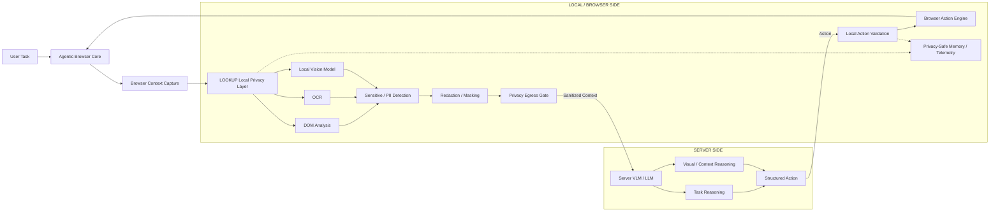
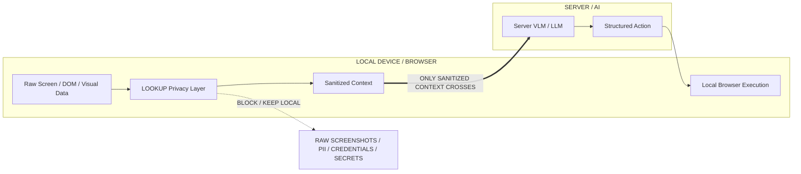

# LOOKUP — Project Proposal / Documentation Content

> **SOURCE-OF-TRUTH CONTENT FILE**
>
> This file is the canonical content source for the LOOKUP project-proposal/documentation website.
> An AI coding agent should read this file before writing or modifying website content.
>
> **Important project status:** LOOKUP is being presented as a **project idea, proposed architecture, technical approach and intended workflow**. The complete end-to-end system is **not currently fully working/production-complete**. Website content must therefore explain what the system is designed to do, how the proposed architecture works, and why the approach is feasible. Do **not** present every proposed component as already implemented or fully operational.

---

# 1. Project Identity

## Project Name

**LOOKUP**

## Project Positioning

**Privacy-Preserving Browser AI**

## SIH Problem Statement

**On-device Visual Perception for Light-weight Browser Agents**

## Event

**Smart India Hackathon 2026**

## Problem Statement ID

**SIH26171**

## Theme

**Smart Automation**

## Category

**Software**

## Team ID

**164736**

## Team Name

**Gen(AI)Tics**

---

# 2. One-Line Idea

LOOKUP is a proposed on-device privacy layer for browser AI agents that locally understands webpage and visual context, detects sensitive information, sanitizes the context, and allows only task-relevant safe information to reach a server-side AI system.

---

# 3. Executive Summary

Modern browser agents need access to webpage and screen context to understand tasks and perform actions. Cloud AI can provide strong reasoning capabilities, but sending complete screenshots or sensitive webpage content to a remote AI service can expose private information.

Running the entire AI system locally can reduce exposure, but client devices and browsers may have limited compute, memory and battery resources.

LOOKUP proposes a hybrid architecture that separates **privacy-sensitive perception and enforcement** from **heavy AI reasoning**.

The browser/device performs privacy-related processing locally. The local privacy layer analyzes webpage structure and visual content, detects sensitive information, applies redaction or masking, and creates a sanitized context. Only that sanitized, task-relevant context is allowed to cross the privacy boundary to the server-side AI.

The server-side AI reasons over the sanitized context and returns a structured browser action. The action is then validated and executed locally in the browser.

The core idea is:

> **The AI should see only what it needs, while sensitive browser data remains protected on the device.**

---

# 4. The Problem

Browser agents require context to perform useful tasks. That context can include:

- DOM structure
- Page text
- Links
- Images
- Visual layout
- Screenshots
- User-specific information visible on the page
- Credentials or secrets accidentally present on the screen

A naive cloud-agent workflow may send too much of this context to a server.

This creates a privacy challenge:

```text
Browser / Screen
      |
      v
Complete context captured
      |
      v
Cloud AI
      |
      v
Sensitive information may leave the device
```

At the other extreme, a completely local AI system may be constrained by device resources.

LOOKUP proposes an intermediate architecture:

```text
Privacy-sensitive perception  -> local
Heavy reasoning               -> server AI
Browser action execution      -> local
```

---

# 5. Why the Problem Is Difficult

## 5.1 Sensitive information is not only plain text

Sensitive information can appear in normal HTML text, but it can also be embedded in images, screenshots, rendered UI, visual layouts or other visual regions.

Therefore, a privacy layer should not depend on a single detection technique.

## 5.2 Blind masking reduces usefulness

If an entire page is masked simply because a small part contains sensitive information, the AI may lose the information it actually needs to complete the task.

For example, if the task is:

> “Compare prices on this page.”

The AI may need product names, displayed prices and relevant product visuals, but it may not need a user's email address, phone number, account information or private messages that also happen to be visible.

This motivates **task-aware privacy** and **minimum-context sharing**.

## 5.3 Privacy decisions can be uncertain

A privacy system can make both false-positive and false-negative decisions.

- A false negative can allow sensitive information to pass through.
- A false positive can hide useful content and reduce usability.

LOOKUP therefore proposes multiple detection signals and a fail-closed approach for uncertain cases.

---

# 6. LOOKUP Solution

LOOKUP is a proposed privacy-preserving middleware layer between a browser agent and an AI reasoning system.

Its job is not to replace the browser agent. Its job is to control what browser context the AI is allowed to see.

## High-Level Flow

```text
User Task
   |
   v
Agentic Browser
   |
   v
Context Capture
   |
   v
LOOKUP Local Privacy Layer
   |
   +--> DOM analysis
   +--> OCR
   +--> Local visual analysis
   +--> Sensitive / PII detection
   +--> Privacy policy checks
   +--> Redaction / masking
   +--> Privacy egress gate
   |
   v
Sanitized Task-Relevant Context
   |
   v
Server-side VLM / LLM
   |
   v
Structured Action
   |
   v
Local Action Validation
   |
   v
Browser Action Execution
   |
   v
Updated Page / Next Agent Step
```

---

# 7. Core Innovation

## 7.1 Task-Aware Privacy Firewall

LOOKUP uses the user's task to determine what information is needed instead of blindly masking the entire page.

### Example

**User task:**

> Compare prices on this page.

**Potentially required context:**

- Product name
- Product price
- Relevant product image or UI region

**Potentially unnecessary context:**

- Email address
- Phone number
- Account details
- Private messages
- Credentials
- Unrelated personal information

The design goal is to preserve useful task context while filtering unrelated sensitive content.

---

## 7.2 Multi-Source Local Perception

LOOKUP proposes combining multiple sources locally:

### DOM

Provides structural webpage information such as:

- Text
- Links
- Elements
- Page structure

### OCR

Extracts text embedded inside visual content.

### Local Vision

Analyzes visual regions and visual page content using browser-side inference.

These signals can be combined to identify sensitive regions while preserving relevant UI context.

---

## 7.3 Minimum-Context Sharing

The system is designed to send the smallest useful task-relevant context rather than the complete raw browser state.

```text
Raw Browser State
       |
       v
Local Task Analysis
       |
       v
Sensitive Data Detection
       |
       v
Redaction / Masking
       |
       v
Task-Relevant Sanitized Context
       |
       v
Server AI
```

This is a core design principle, not a claim of measured data reduction.

---

## 7.4 Privacy Confidence Gate

Before context leaves the browser, LOOKUP proposes a privacy egress decision.

If sensitive-data detection is uncertain, the safe behavior is to block or hold the context rather than allow potentially unsafe transmission.

```text
Safe to share?
   |
   +---- YES ----> Sanitized Context -> Server AI
   |
   +---- NO / UNCERTAIN ----> Block / Process Further
```

This is the proposed **fail-closed privacy behavior**.

---

# 8. End-to-End User Flow

## Step 1 — Open & Ask

The user opens a supported browser environment with LOOKUP and provides a task.

Example:

> “Compare prices on this page.”

The system may also expose suggested tasks.

## Step 2 — Smart Capture

LOOKUP determines what kind of webpage context is needed.

Possible sources:

- DOM capture
- Screenshot capture
- Adaptive capture

### DOM Capture

Useful for structured page information such as text, links and elements.

### Screenshot Capture

Useful for visual or more complex tasks where visual structure matters.

### Adaptive Capture

The proposed design can choose DOM-only, screenshot-only or a combination based on the task.

## Step 3 — Local Privacy Guard

The captured context is processed locally.

```text
Screen / Page Input
      |
      v
OCR / DOM / Vision
      |
      v
Sensitive Detection
      |
      v
Redaction / Masking
      |
      v
Sanitized Context
```

## Step 4 — Server-Side AI Processing

The server-side VLM/LLM receives only sanitized context.

It is intended to:

- understand the task
- reason over the available safe context
- determine the next action
- generate a structured action output

## Step 5 — Action Decision

Possible structured actions include:

- Click
- Scroll
- Type
- Navigate
- Other supported browser actions

## Step 6 — Execute in Browser

The action is returned to the browser, validated locally, and then executed on the page.

The updated page can become the context for the next step in the agent loop.

---

# 9. Proposed System Architecture

## 9.1 Local / Browser Side

The local side contains the components responsible for browser interaction, context capture, privacy enforcement and local action validation.

### Agentic Browser Core

Responsibilities:

- Planning
- Understanding the task flow
- Navigation
- Managing page state
- Executing validated browser actions

### Browser Context Capture

Responsibilities:

- DOM capture
- Screenshot capture
- Adaptive capture based on task needs

### LOOKUP Local Privacy Layer

Main proposed modules:

1. Task Context Analyzer
2. Local Vision Model
3. OCR
4. Sensitive / PII Detection
5. Privacy Policy Engine
6. Redaction / Masking
7. Privacy Egress Gate

### Local Action Validation

Before browser execution, the local layer is intended to:

- Check page state
- Verify permissions
- Prevent unintended access to protected/redacted content
- Validate action safety

### Privacy-Safe Memory / Telemetry

The proposed design stores sanitized history, task state and metrics instead of raw screenshots or secrets.

---

# 10. Trust Boundary

The trust boundary is one of the most important architectural concepts in LOOKUP.

```text
================ LOCAL / DEVICE =================

User
  |
  v
Browser Agent
  |
  v
Context Capture
  |
  v
LOOKUP Privacy Layer
  |
  +--> DOM
  +--> OCR
  +--> Local Vision
  +--> Sensitive Detection
  +--> Redaction
  +--> Privacy Policy
  +--> Egress Decision

  |
  v
Sanitized Context

================ TRUST BOUNDARY =================
                 |
                 v
================ SERVER / AI ====================

Server VLM / LLM
  |
  +--> Task Reasoning
  +--> Visual Reasoning
  +--> Structured Action

  |
  v
Action returned to browser
```

### Privacy Boundary Rule

**Raw screenshots, PII, credentials and secrets are intended to remain local.**

Only sanitized task-relevant context should cross the trust boundary.

---

# 11. Server-Side AI

The server-side model is responsible for heavy reasoning over safe context.

The intended processing is:

```text
Sanitized Context
       |
       v
Task Reasoning
       |
       v
Visual / Context Reasoning
       |
       v
Structured Action Output
```

The architecture is designed so that the AI backend can be changed without fundamentally changing the browser-side privacy boundary.

Do not describe any specific cloud provider as mandatory unless it is explicitly implemented in the current codebase.

---

# 12. Browser-Side AI / Local Inference

The proposal uses browser-compatible local inference technologies for lightweight visual processing.

The technical direction includes:

- WebGPU
- ONNX Runtime Web
- WASM fallback when required

The purpose is to keep privacy-sensitive visual processing close to the browser/device while avoiding the resource requirements of a large fully local general-purpose AI system.

This website should describe this as the **proposed technical approach**, not as a benchmarked production capability.

---

# 13. Technology Stack

| Technology | Intended Role |
|---|---|
| WebExtension MV3 | Browser extension architecture for Chrome / Firefox |
| TypeScript | Core development |
| React | Extension UI |
| Tesseract.js | OCR |
| WebGPU + ONNX | Local vision inference |
| Canvas API | Redaction / masking |
| Node.js | Backend API |
| Cloud VLM / LLM | Server-side reasoning |

These technologies represent the technical approach described in the project proposal. The website must not imply that every component is already fully integrated if the current implementation does not support that claim.

---

# 14. Privacy Model

## Data Intended to Stay on Device

- Raw screenshots
- PII / personal data
- Credentials
- Secrets
- Sensitive visual information

## Data Intended to Reach AI

- Sanitized context
- Relevant UI elements
- Required visual regions
- Task-related information

```text
                    LOOKUP
                       |
         +-------------+-------------+
         |                           |
         v                           v
   STAYS ON DEVICE              SENT TO AI
   ----------------             ----------------
   Raw screenshot               Sanitized context
   PII / personal data         Relevant UI elements
   Credentials / secrets       Required visual regions
   Sensitive visual data       Task-related information
```

This is an architectural policy boundary, not a measured security guarantee.

---

# 15. Agent Execution Loop

LOOKUP is intended to support iterative browser-agent tasks.

```text
User Task
   |
   v
Capture
   |
   v
Local Privacy Processing
   |
   v
Sanitized Context
   |
   v
Server AI Reasoning
   |
   v
Structured Action
   |
   v
Local Action Validation
   |
   v
Browser Execution
   |
   v
Updated Page State
   |
   v
Next Agent Step
```

The loop can repeat until the task is completed or the workflow stops.

---

# 16. Example Scenario

## User

> “Compare prices on this page.”

## Proposed LOOKUP flow

```text
Web Page
   |
   v
Task Analysis
   |
   v
Capture Relevant Context
   |
   v
Local Sensitive Detection
   |
   v
Mask / Redact Sensitive Regions
   |
   v
Create Sanitized Context
   |
   v
Server AI Reasoning
   |
   v
Return Structured Action
   |
   v
Validate Locally
   |
   v
Execute in Browser
```

### Key point

The important design change is not simply “run AI locally.”

The design separates:

- **local privacy enforcement**
- **server-side heavy reasoning**
- **local browser execution**

---

# 17. Feasibility

## Device Limitations

Large vision models may increase memory use, latency and battery consumption.

### Proposed mitigation

- Lightweight models
- Quantized models
- Processing only relevant regions
- WASM fallback when needed

## Browser Differences

WebGPU support and behavior can differ across browsers.

### Proposed mitigation

- Feature detection
- Browser-specific fallbacks
- Modular architecture

## Privacy Accuracy

False negatives can expose sensitive information while false positives can reduce usability.

### Proposed mitigation

- Multi-signal verification
- DOM + OCR + vision
- Fail-closed privacy behavior for uncertain cases

## Extension Constraints

Manifest V3 service workers have limitations related to direct DOM access.

### Proposed mitigation

- Content scripts
- Offscreen processing where appropriate
- Keep privacy logic modular and independent from the AI layer

---

# 18. Viability

The proposal identifies three practical characteristics.

## Easy Deployment

The privacy layer is designed to operate as a browser extension.

## Model Independent

The AI backend is intended to be replaceable without changing the overall privacy boundary.

## Scalable

The architecture is intended to support different browser-agent workflows.

These are architectural goals, not measured deployment results.

---

# 19. Impact

LOOKUP is intended to make browser-agent workflows more privacy-aware without requiring all reasoning to run locally.

## Privacy & Security

Sensitive visual information is intended to be processed locally before external AI access.

## Useful AI on Low-Resource Devices

Lightweight local processing handles privacy-sensitive tasks while server AI handles heavier reasoning.

## Broader AI Adoption

Privacy-aware browser AI may be more practical for workflows involving sensitive webpages and screen content.

## Reduced Unnecessary Data Sharing

The architecture sends required sanitized context instead of the complete raw visual state.

## Potential Efficiency Gain

Local filtering may reduce unnecessary visual data sent to the server. The actual benefit depends on model size, task complexity and network usage.

Do not convert this into a numeric performance claim unless benchmark data is later provided.

---

# 20. Unique Selling Points / USP

## Minimum-Disclosure Context

Dynamically send only the safest task-relevant browser context required by the AI.

## Multimodal Privacy Guard

Combine DOM, OCR and local vision to protect visual and structural information.

## Drop-In Agent Privacy

Add privacy enforcement around browser-agent workflows without requiring the underlying agent concept to be replaced.

---

# 21. Comparison With Existing Approaches

The proposal compares LOOKUP with other browser-agent/privacy-oriented approaches.

| Capability | NanoBrowser | SafeScreen | Agent Browser | LOOKUP |
|---|---|---|---|---|
| AI Browser Automation | ✓ | ✓ | ✓ | ✓ |
| Local Privacy Protection | ✕ | ✓ | ✕ | ✓ |
| Visual + OCR + DOM | Limited / partial | Limited / privacy-assisted | ✓ | ✓ |
| Task-Aware Context | Partial / agent-context dependent | Privacy-focused | ✓ | ✓ |
| Fail-Closed Privacy | ✕ | ✓ | Partial | ✓ |

This table reflects the comparison presented in the proposal. Do not expand it with unsupported technical claims.

---

# 22. Research & References

The proposal references these technical areas:

1. **ONNX Runtime Web — WebGPU**
   - Browser-side ML inference
   - WebGPU acceleration

2. **Transformers.js WebGPU Guide**
   - Browser-based AI inference
   - Lightweight / quantized model usage

3. **MDN WebExtensions**
   - Extension architecture
   - Content scripts
   - Page access
   - Cross-browser extension development

4. **Chrome Offscreen API**
   - Processing patterns related to Manifest V3 environments where service workers cannot directly access the DOM in the same way as a normal page

Use verified external URLs when publishing reference links. Do not invent links.

---

# 23. What LOOKUP Is

LOOKUP is:

- A proposed privacy middleware layer for browser agents
- A client-side privacy enforcement architecture
- A multimodal local perception layer
- A task-aware context filtering mechanism
- A hybrid local-privacy / server-reasoning design
- A browser-extension-oriented architecture

---

# 24. What LOOKUP Is Not

LOOKUP is not intended to be described as:

- A fully local general-purpose AI assistant
- A replacement for all browser agents
- A guarantee that every possible sensitive item will always be detected
- A production-scale security product
- A benchmark-proven system unless measurements are explicitly available
- A finished end-to-end production implementation

---

# 25. Current Project Status — IMPORTANT

The complete system is **not currently fully working**.

Therefore, the documentation website should use language such as:

- “proposed architecture”
- “designed to”
- “intended to”
- “the system aims to”
- “planned workflow”
- “technical approach”
- “prototype direction”

Avoid language such as:

- “fully implemented”
- “production-ready”
- “guarantees privacy”
- “achieves X% accuracy”
- “reduces data by X%”
- “runs at X ms latency”

unless those facts are explicitly verified from the current implementation or measured benchmarks.

The website is a **project proposal / technical concept documentation site**, not a claim that every architecture component is already complete.

---

# 26. Recommended Website Information Architecture

```text
LOOKUP
│
├── Overview
├── Problem Statement
│   ├── Privacy Challenge
│   ├── Cloud AI Trade-off
│   └── Local AI Trade-off
│
├── Solution
│   ├── Task-Aware Privacy Firewall
│   ├── Multi-Source Local Perception
│   ├── Minimum-Context Sharing
│   └── Privacy Confidence Gate
│
├── User Flow
├── System Architecture
│   ├── Browser / Agent Layer
│   ├── Context Capture
│   ├── Local Privacy Layer
│   ├── Trust Boundary
│   ├── Server AI
│   └── Local Action Execution
│
├── Technology Stack
├── Privacy Model
├── Agent Execution Loop
├── Feasibility
├── Viability
├── Impact & Benefits
├── USP
├── Comparison
├── Research & References
└── SIH / Team Information
```

---

# 27. Website Writing Rules

The AI coding agent building the website must follow these rules.

## Rule 1 — Explain the idea first

The visitor should understand the problem, solution and privacy boundary before seeing implementation details.

## Rule 2 — Separate “Proposed” from “Implemented”

Architecture diagrams can show the intended system. They must not imply that every block is already implemented.

## Rule 3 — Do not invent metrics

No invented latency, accuracy, benchmark, cost, throughput, model score or privacy percentage.

## Rule 4 — Do not turn the website into a generic landing page

The site should look like technical documentation / project specification.

## Rule 5 — Prefer diagrams and structured explanations

Use architecture diagrams, flow diagrams, tables, code-style blocks and callouts to explain the concept.

## Rule 6 — Keep the key privacy boundary obvious

A visitor should quickly understand:

```text
RAW SENSITIVE DATA
        |
        | stays local
        v
LOOKUP PRIVACY LAYER
        |
        | sanitized context only
        v
SERVER AI
```

## Rule 7 — Preserve project terminology

Use these terms consistently:

- LOOKUP
- Privacy-Preserving Browser AI
- On-device Visual Perception
- Task-Aware Privacy Firewall
- Multi-Source Local Perception
- Minimum-Context Sharing
- Privacy Confidence Gate
- Sanitized Context
- Trust Boundary
- Local Action Validation

---

# 28. Architecture Diagram — Mermaid



---

# 29. Privacy Boundary Diagram — Mermaid



---

# 30. Short Judge-Friendly Explanation

LOOKUP adds a privacy layer to browser AI agents.

Instead of sending the entire screen to an AI server, LOOKUP first analyzes the page locally using DOM information, OCR and lightweight visual processing. It identifies sensitive information, masks it and creates a task-specific safe context.

Only that sanitized context is sent to the AI for reasoning. The AI returns an action, and the browser validates and executes that action locally.

So the architecture follows:

> **Understand locally → Protect locally → Share minimally → Execute locally.**

---

# 31. Short Website Hero Content

## LOOKUP
### Privacy-Preserving Browser AI

**On-device visual perception for lightweight browser agents.**

LOOKUP proposes a local privacy layer that protects sensitive webpage and screen information before browser context is shared with AI.

**Understand locally. Protect locally. Share minimally. Execute locally.**

---

# 32. Website Disclaimer / Status Callout

Recommended visible documentation note:

> **Project status:** LOOKUP is currently documented as a proposed architecture and prototype direction. The website explains the intended system, workflow, privacy model and technical approach. It does not claim that every proposed component is already fully implemented.

---

# 33. Source Material Mapping

This content is derived from the submitted SIH proposal material:

- Page 1: SIH identity, problem statement and team information
- Page 2: LOOKUP concept, problem, solution innovation and user flow
- Page 3: technical approach, technology stack and detailed local/server architecture
- Page 4: feasibility, risks, mitigations and viability
- Page 5: impact, benefits and privacy data boundary
- Page 6: research references and comparison with existing solutions

The website should preserve that logical progression while presenting it as a coherent technical documentation site.
